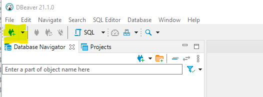
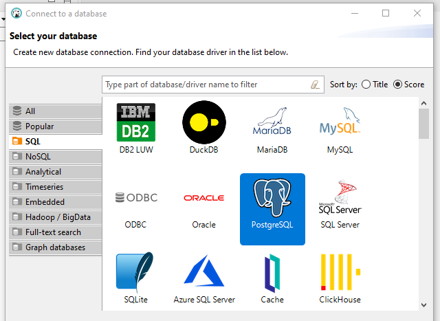
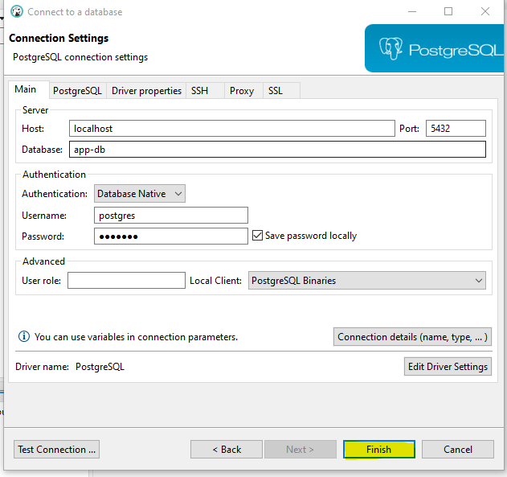
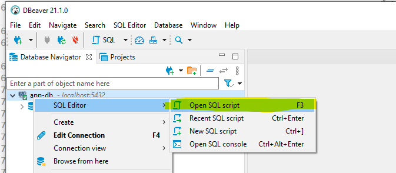
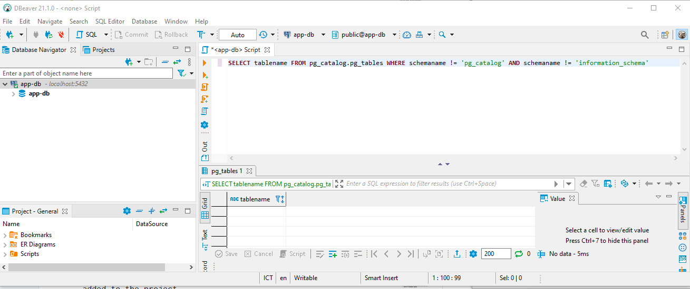

# Microsoft.Learn.SecureAspnetCoreIdentity

This project will be followed the learn modules: [Secure an ASP.NET Core web app with the Identity framework](https://docs.microsoft.com/en-us/learn/modules/secure-aspnet-core-identity/)

This project was created from the [Code](https://github.com/MicrosoftDocs/mslearn-aspnet-core/tree/master/modules/secure-aspnet-core-identity)

## Project Structure 
```
├───start # Starter template
└───final # Final code from this tutorial 
```

Note: The original article was designed in Azure Cloud Shell. Some how I can't use it one the website. So, I modify the article for local development.

The original article provides PosgreSQL & SQL Server, this article will apply docker and PosgreSQL for local development.

# Lesson

1. [Introduction](#unit-1-introduction)
2. [Set up the environment](#unit-2-set-up-the-environment)
3. [Configure Identity support](#unit-3-configure-identity-support)
4. [Customize Identity](#unit-4-customize-identity)
5. [Configure multi-factor authentication](#unit-5-configure-multi-factor-authentication)
6. [Use claims with policy-based authorization](#unit-6-use-claims-with-policy-based-authorization)

# Unit 1: Introduction

An online dog toy retailer, named Contoso Pets, is creating an app for viewing and managing the product catalog. You're asked to secure the app.

This module explores using ASP.NET Core Identity to support authentication and authorization in an ASP.NET Core Razor Pages web app.

## Learning objectives

In this module, you will:

- Configure Identity support in an existing ASP.NET Core web app.
- Provide new user registration capabilities.
- Extend Identity UI components.
- Customize multi-factor login capabilities.
- Implement policy-based authorization using claims.
- Customize and extend the underlying Identity data store.

<!-- more -->

## Prerequisites
- Experience writing C# at the beginner level
- Experience using relational databases and SQL as a developer
- Familiarity with Entity Framework (EF) Core migrations
- Ability to write Razor at the beginner level
Familiarity with a time-based one-time password (TOTP) authenticator app, such as Microsoft Authenticator (available in the [Google Play Store](https://play.google.com/store/apps/details?id=com.azure.authenticator) or the [Apple App Store](https://apps.apple.com/app/microsoft-authenticator/id983156458))

# Unit 2: Set up the environment

In this unit, you'll gain an understanding of Identity architecture. You'll start by running a script to set up the module's Linux development environment. ~~The script downloads a cross-platform starter project and provisions Azure resources to support tasks throughout the module. Identity will be added to the starter project.~~

This module focuses on just two of the possible EF Core data stores supported by Identity.

Set up development environment
Run the following command in the command shell.

```sh
git clone https://github.com/mildronize/DotNetCore-Sample  \ 
    && cd Microsoft.Learn.SecureAspnetCoreIdentity
cd start
docker-compose up
```

Software Requirement:
- Docker
- DBeaver

The preceding command retrieves and runs a setup script from a GitHub repository. The script completes the following steps:

- Clones the ASP.NET Core starter code from a GitHub repository.
- Builds and deploys an ASP.NET Core web API to supply the web app with data.
- Provisions a database ~~to store Identity framework entities~~.

## Review ASP.NET Core Identity architecture

ASP.NET Core Identity is a membership system that adds user registration and login capabilities to an ASP.NET Core web UI. The membership system handles both authentication and authorization concerns. Authentication is concerned with who you are. Authorization is concerned with what you're allowed to do. Authentication is therefore a prerequisite for authorization.

As an alternative to local account creation, Identity supports external login providers such as Facebook and Twitter. User sessions are preserved using cookie-based authentication. By default, a cookie is created upon log in and destroyed upon log out.

Membership data is persisted using a data store and data access technology of your choosing. The default data access technology is an Object-Relational Mapper (O/RM) called Entity Framework (EF) Core. The default data store is SQL Server.

The intricacies of interacting with the underlying database are abstracted away by EF Core. Therefore, EF Core generally makes it possible to use any of its database providers with Identity. Database providers are available for PostgreSQL, SQLite, and several other data stores. PostgreSQL, however, is a third-party provider and is therefore not eligible for support from Microsoft. Identity also provides the flexibility to use a data access technology of your choosing. Dapper is one popular alternative.

The following diagram depicts the Identity architecture used in this module:


In the preceding diagram:
- The *ASP.NET Core Razor Pages* app represents the web UI to which Identity support will be added in this module.
- The *Identity Manager* layer contains classes used from the `Microsoft.AspNetCore.Identity` namespace. Examples of such classes used explicitly in this module are `SignInManager<TUser>` and `UserManager<TUser>`.
- The *EF Core Identity Store* layer contains classes from the `Microsoft.AspNetCore.Identity.EntityFrameworkCore` namespace. An example of such a class used implicitly in this module is `UserStore<TUser>`.
- The *Database Provider* is a database-specific library that accepts SQL from the *EF Core Provider* (not pictured) and executes it.

## Review project requirements

Your stakeholders have defined the following business requirements:

- There are two types of authenticated users for the system: employees and administrators.
- Anonymous users aren't allowed to view the product catalog.
- Employees can only view the product catalog.
- Administrators can modify products.
- Upon successful login, the user's first and last name should appear in the app's header.

Your development team makes the following technical decisions:

- Identity data should be isolated in its own database.
- The database tables supporting Identity should belong to the default schema.
- Administrators will self-enroll using a single-use token.
- The app must support logging in with multi-factor authentication using a TOTP authenticator app.
- ~~The database credentials should be stored in Azure Key Vault.~~

## Review starter code

The app consists of a single ASP.NET Core Razor Pages project named *ContosoPets.Ui*. The project contains the user interface for viewing and managing product data. The product data is obtained via an external ASP.NET Core web API.

Of particular interest are the following files and directories in *ContosoPets.Ui*:

| Name                                        | Description                                                                                       |
| :------------------------------------------ | :------------------------------------------------------------------------------------------------ |
| *Controllers/AdminTokenController.cs*       | Exposes `AdminRegistrationTokenService` as an HTTP endpoint. Unused until Unit 6.                 |
| *Pages/Products/*                           | Contains web UI for CRUD operations.                                                              |
| *Services/AdminRegistrationTokenService.cs* | Generates tokens allowing administrators to self-register. Unused until Unit 6.                   |
| *Services/ProductService.cs*                | Manages all interactions with the external ASP.NET Core web API.                                  |
| *Services/QRCodeService.cs*                 | Manages the creation of QR codes for supporting multi-factor authentication. Unused until Unit 5. |
| *wwwroot/js/product.js*                     | Enables deletion of a product from *Pages/Products/Index.cshtml* without a server-side postback.  |
| *Program.cs*                                | Serves as the app's main entry point and registers the Azure Key Vault configuration provider.    |
| *Startup.cs*                                | Configures services and the app's HTTP request pipeline.                                          |

~~**Note:**~~

~~Azure Key Vault is used to securely store and retrieve sensitive data. The starter code implements it to demonstrate one possible way to secure database credentials. It's unrelated to Identity and therefore out of scope for this module. See the ConfigureKeyVault method in the Program.cs file for the Key Vault registration code.~~

## Verify database connectivity

Create DBeaver Conntection to Postgres.



Select and Download Postgres Driver.



Fill the database connection info.

```
Host=localhost;
Port=5432;
Database=app-db;
Username=postgres;
Password=123456$
```



Open SQL Editor on DBeaver,



Run the following command:

```bash
SELECT tablename FROM pg_catalog.pg_tables WHERE schemaname != 'pg_catalog' AND schemaname != 'information_schema'
```

The preceding command retrieves a list of non-system tables from the PostgreSQL database that was created earlier.

As expected, the list is empty because the database only contains system tables.

```sh
 tablename 
-----------
(0 rows)
```



# Unit 3: Configure Identity support

Identity works out-of-the-box without any customization. The standard Identity UI components are packaged in a .NET Standard Razor Class Library (RCL). Because an RCL is used, few files are added to the project.

After applying the initial EF Core migration, the supporting database tables are created. The following diagram depicts the schemas of the supporting tables:


**Note:**

The above image shows the key(s) and relationships in the database. The key is a one, and the infinity (sideways 8) is a many. A database can have 1 to 1, 1 to many, and many to many relationship types. Keys are unique. The diagram shows how these joins are created, and the relationships.

In this unit, Identity will be added to the existing ASP.NET Core Razor Pages project.

## Add Identity to the project

1. Install the ASP.NET Core code scaffolder:

   

   ```sh
   dotnet tool install dotnet-aspnet-codegenerator --version 3.1.5
   ```

   The following output appears:

   

   ```sh
   You can invoke the tool from this directory using the following commands: 'dotnet tool run dotnet-aspnet-codegenerator' or 'dotnet dotnet-aspnet-codegenerator'.
   Tool 'dotnet-aspnet-codegenerator' (version '3.1.5') was successfully installed. Entry is added to the manifest file /home/<USER>/aspnet-learn/src/ContosoPets.Ui/.config/dotnet-tools.json.
   ```

   The scaffolder is a .NET Core tool that will:

   - Be used to add the default Identity components to the project.
   - Enable customization of Identity UI components in the next unit.
   - Be invoked via `dotnet aspnet-codegenerator` in this module.

2. Add the following NuGet packages to the project:

   

   ```sh
    dotnet add package Microsoft.VisualStudio.Web.CodeGeneration.Design --version 3.1.5
    dotnet add package Microsoft.AspNetCore.Identity.EntityFrameworkCore --version 3.1.3
    dotnet add package Microsoft.AspNetCore.Identity.UI --version 3.1.3
    dotnet add package Microsoft.EntityFrameworkCore.Design --version 3.1.3
    dotnet add package Microsoft.EntityFrameworkCore.SqlServer --version 3.1.3
   ```


   These packages install code generation templates and dependencies that are used by the scaffolder.

    Tip

   To view the available generators:

   - In the command shell, run `dotnet aspnet-codegenerator -h`.
   - When in Visual Studio, right-click the project in **Solution Explorer** and select **Add** > **New Scaffolded Item**.

3. Use the scaffolder to add the default Identity components to the project. Run the following command from the project root:
4. 
   ```sh
   dotnet aspnet-codegenerator identity --useDefaultUI --dbContext ContosoPetsAuth
   ```

   In the preceding command:

   - The generator identified as `identity` is used to add the Identity framework to the project.
   - The `--useDefaultUI` option indicates that an RCL containing the default UI elements will be used. Bootstrap will be used to style the components.
   - The `--dbContext` option to indicate the name of an EF Core database context class to generate.

5. You will see *Areas* directory.
   
   An *Areas* directory structure appears in the project root:

   - Areas
     - Identity
       - Data
         - *ContosoPetsAuth.cs*
       - Pages
         - *_ValidationScriptsPartial.cshtml*
         - *_ViewStart.cshtml*
       - *IdentityHostingStartup.cs*

   Areas provide a way to partition an ASP.NET Core web app into smaller functional groups.

## Add the PostgreSQL database provider

Run the following command from the project root to install the PostgreSQL database provider for EF Core:


```sh
dotnet add package Npgsql.EntityFrameworkCore.PostgreSQL --version 3.1.3
```

This NuGet package provides EF Core with knowledge of how to interact with a PostgreSQL database.

## Configure the database connection

1. Replace the `Configure` method of *Areas/Identity/IdentityHostingStartup.cs* with the following code:

   

   ```csharp
   public void Configure(IWebHostBuilder builder)
   {
       builder.ConfigureServices((context, services) => {
            // Note: Using Azure Key Vault for production, see in the original article.
            services.AddDbContext<ContosoPetsAuth>(options =>
                options.UseNpgsql(context.Configuration.GetConnectionString("ContosoPetsAuthConnection")));

            services.AddDefaultIdentity<IdentityUser>()
                .AddDefaultUI()
                .AddEntityFrameworkStores<ContosoPetsAuth>();
       });
   }
   ```

   In the preceding code:

   - The database username and password are injected into the connection string stored in *appsettings.json*.

   - The EF Core database context class, named `ContosoPetsAuth`, is configured with the appropriate connection string.

   - The Identity services are registered, including the default UI, token providers, and cookie-based authentication.

2. Also in *IdentityHostingStartup.cs*, add the following code to the block of `using` statements at the top. Save your changes.

   

   ```csharp
   using Npgsql;
   ```

   The preceding code resolves the reference to the `NpgsqlConnectionStringBuilder` class in the `Configure` method.

3. In the `Configure` method of *Startup.cs*, replace the `// Add the app.UseAuthentication code` comment with the following code. Save your changes.

   

   ```csharp
   app.UseAuthentication();
   ```

   The preceding code enables authentication capabilities. More specifically, an instance of the ASP.NET Core authentication middleware is added to the app's HTTP request-handling pipeline.

4. In *appsettings.json*, replace the connection string for `ContosoPetsAuthConnection` with the connection string from the previous step. Save your changes.

   ```json
   "ConnectionStrings": {
     "ContosoPetsAuthConnection": "Server=localhost;Port=5432;Database=app-db;User Id=postgres;Password=123456$;"
    }
   ```

5. Run the following command to build the app:


   ```sh
   dotnet build
   ```

   The build succeeds with no warnings. If the build fails, check the output for troubleshooting information.

## Update the database

1. Install the Entity Framework Core migration tool:

   

   ```sh
   dotnet tool install dotnet-ef --version 3.1.3
   ```

   The following output appears:

   

   ```sh
   You can invoke the tool from this directory using the following commands: 'dotnet tool run dotnet-ef' or 'dotnet dotnet-ef'.
   Tool 'dotnet-ef' (version '3.1.3') was successfully installed. Entry is added to the manifest file /home/<USER>/aspnet-learn/src/ContosoPets.Ui/.config/dotnet-tools.json.
   ```

   The migration tool is a .NET Core tool that will:

   - Generate code called a migration to create and update the database that supports the Identity entity model.
   - Execute migrations against an existing database.
   - Be invoked via `dotnet ef` in this module.

2. Create and run an EF Core migration to update the database:

   

   ```sh
   dotnet ef migrations add CreateIdentitySchema && \
       dotnet ef database update
   ```

   The `CreateIdentitySchema` EF Core migration applied a Data Definition Language (DDL) change script to create the tables supporting Identity. For example, the following excerpt depicts a `CREATE TABLE` statement generated by the migration:

   

   ```sh
   info: Microsoft.EntityFrameworkCore.Database.Command[20101]
     Executed DbCommand (329ms) [Parameters=[], CommandType='Text', CommandTimeout='30']
     CREATE TABLE "AspNetUsers" (
         "Id" text NOT NULL,
         "UserName" character varying(256) NULL,
         "NormalizedUserName" character varying(256) NULL,
         "Email" character varying(256) NULL,
         "NormalizedEmail" character varying(256) NULL,
         "EmailConfirmed" boolean NOT NULL,
         "PasswordHash" text NULL,
         "SecurityStamp" text NULL,
         "ConcurrencyStamp" text NULL,
         "PhoneNumber" text NULL,
         "PhoneNumberConfirmed" boolean NOT NULL,
         "TwoFactorEnabled" boolean NOT NULL,
         "LockoutEnd" timestamp with time zone NULL,
         "LockoutEnabled" boolean NOT NULL,
         "AccessFailedCount" integer NOT NULL,
         CONSTRAINT "PK_AspNetUsers" PRIMARY KEY ("Id")
     );
   ```

3. Run the following command to list the tables in the database:

   

   ```bash
   db -c "SELECT tablename FROM pg_catalog.pg_tables WHERE schemaname != 'pg_catalog' AND schemaname != 'information_schema' ORDER BY tablename"
   ```

   The output confirms the creation of the tables:


   ```sh
          tablename
   -----------------------
    AspNetRoleClaims
    AspNetRoles
    AspNetUserClaims
    AspNetUserLogins
    AspNetUserRoles
    AspNetUserTokens
    AspNetUsers
    __EFMigrationsHistory
   (8 rows)
   ```

## Add the login and registration links

1. In *Pages/Shared/_Layout.cshtml*, replace the `@* Add the _LoginPartial partial view *@` comment with the following. Save your changes.

   

   ```html
   <partial name="_LoginPartial" />
   ```

   The preceding markup renders the `_LoginPartial` partial view within the header of any page that uses the default layout. `_LoginPartial` was added by the Identity scaffold. This partial view presents the user with **Login** and **Register** links if the user isn't signed in.

2. Run the following command to build the app:

   

   ```sh
   dotnet build --no-restore
   ```

   The `--no-restore` option is included because no NuGet packages were added since the last build. The build process bypasses restoration of NuGet packages and succeeds with no warnings. If the build fails, check the output for troubleshooting information.

3. Run the dotnet run with watch function. Open the browser with `https://localhost:5001`


   ```sh
   donet watch run
   ```

4. Click the **Register** link in the app's header. Complete the form to create a new account.

   After successful registration:

   - You're redirected to the homepage.
   - The app's header displays **Hello [Email address]!** and a **Logout** link.
   - A cookie named *.AspNetCore.Identity.Application* is created. Identity preserves user sessions with cookie-based authentication.

5. Click the **Logout** link in the app's header.

   After successfully logging out, the *.AspNetCore.Identity.Application* cookie is deleted to terminate the user session.


# Unit 4: Customize Identity

By default, Identity represents a user with an `IdentityUser` class. One way to extend the data being captured at registration time is to create a class deriving from `IdentityUser`. In this unit, a derived class named `ContosoPetsUser` is created. `ContosoPetsUser` will contain properties to store the user's first and last name.


UI changes are also required to collect the additional user profile information. The following steps explain the process of collecting a first and last name for the registered user.

## Customize the user account data

1. Add the user registration files to be modified to the project:

   

   ```sh
   dotnet aspnet-codegenerator identity \
       --dbContext ContosoPetsAuth \
       --files "Account.Manage.EnableAuthenticator;Account.Manage.Index;Account.Register" \
       --userClass ContosoPetsUser \
       --force
   ```

   In the preceding command:

   - The `--dbContext` option provides the tool with knowledge of the existing `DbContext`-derived class named `ContosoPetsAuth`.
   - The `--files` option specifies a semicolon-delimited list of unique files to be added to the *Identity* area.
   - The `--userClass` option results in the creation of an `IdentityUser`-derived class named `ContosoPetsUser`.
   - The `--force` option causes existing files in the *Identity* area to be overwritten.

    Tip

   Run the following command from the project root to view valid values for the `--files` option:

   

   ```sh
   dotnet aspnet-codegenerator identity --listFiles
   ```

   The following files are added to the *Areas/Identity* directory:

   - Data/
     - *ContosoPetsUser.cs*
   - Pages/
     - *_ViewImports.cshtml*
     - Account/
       - *_ViewImports.cshtml*
       - *Register.cshtml*
       - *Register.cshtml.cs*
       - Manage/
         - *_ManageNav.cshtml*
         - *_ViewImports.cshtml*
         - *EnableAuthenticator.cshtml*
         - *EnableAuthenticator.cshtml.cs*
         - *Index.cshtml*
         - *Index.cshtml.cs*
         - *ManageNavPages.cs*

   Additionally, the *Data/ContosoPetsAuth.cs* file, which existed before running the preceding command, was overwritten because the `--force` option was used. The `ContosoPetsAuth` class declaration now references the newly created user type of `ContosoPetsUser`:

   

   ```csharp
   public class ContosoPetsAuth : IdentityDbContext<ContosoPetsUser>
   ```

   The *EnableAuthenticator* Razor page was scaffolded, though it won't be modified until later in the module.

2. In the `Configure` method of *Areas/Identity/IdentityHostingStartup.cs*, the call to `AddDefaultIdentity` needs to be made aware of the new Identity user type. Incorporate the following highlighted change, and save the file.

   

   ```csharp
   services.AddDefaultIdentity<ContosoPetsUser>()
       .AddDefaultUI()
       .AddEntityFrameworkStores<ContosoPetsAuth>();
   ```

3. Update *Pages/Shared/_LoginPartial.cshtml* to incorporate the following highlighted changes. Save your changes.

   

   ```html
   @using Microsoft.AspNetCore.Identity
   @using ContosoPets.Ui.Areas.Identity.Data
   @inject SignInManager<ContosoPetsUser> SignInManager
   @inject UserManager<ContosoPetsUser> UserManager
   
   <ul class="navbar-nav">
   ```

   The preceding changes update the user type passed to both `SignInManager<T>` and `UserManager<T>` in the `@inject` directives. Instead of the default `IdentityUser` type, `ContosoPetsUser` user is now referenced. The `@using` directive was added to resolve the `ContosoPetsUser` references.

   *Pages/Shared/_LoginPartial.cshtml* is physically located outside of the *Identity* area. Consequently, the file wasn't updated automatically by the scaffold tool. The appropriate changes had be made manually.

    Tip

   As an alternative to manually editing the *_LoginPartial.cshtml* file, it can be deleted prior to running the scaffold tool. The *_LoginPartial.cshtml* file will be recreated with references to the new `ContosoPetsUser` class.

4. Update *Areas/Identity/Data/ContosoPetsUser.cs* to support storage and retrieval of the additional user profile data. Make the following changes:

   1. Add the `FirstName` and `LastName` properties:

      

      ```csharp
      public class ContosoPetsUser : IdentityUser
      {
          [Required]
          [MaxLength(100)]
          public string FirstName { get; set; }
      
          [Required]
          [MaxLength(100)]
          public string LastName { get; set; }
      }
      ```

      The properties in the preceding snippet represent additional columns to be created in the underlying `AspNetUsers` table. Both properties are required and are therefore annotated with the `[Required]` attribute. The `[Required]` attribute also results in a non-null constraint in the underlying database table column. Additionally, the `[MaxLength]` attribute indicates that a maximum length of 100 characters is allowed. The underlying table column's data type is defined accordingly.

   2. Add the following `using` statement to the top of the file. Save your changes.

      

      ```csharp
      using System.ComponentModel.DataAnnotations;
      ```

      The preceding code resolves the data annotation attributes applied to the `FirstName` and `LastName` properties.

## Update the database

1. Create and apply an EF Core migration to update the underlying data store:

   

   ```sh
   dotnet ef migrations add UpdateUser && \
       dotnet ef database update
   ```

   The `UpdateUser` EF Core migration applied a DDL change script to the `AspNetUsers` table's schema. Specifically, `FirstName` and `LastName` columns were added, as seen in the following migration output excerpt:

   ConsoleCopy

   ```console
   info: Microsoft.EntityFrameworkCore.Database.Command[20101]
     Executed DbCommand (1,005ms) [Parameters=[], CommandType='Text', CommandTimeout='30']
     ALTER TABLE "AspNetUsers" ADD "FirstName" character varying(100) NOT NULL DEFAULT '';
   info: Microsoft.EntityFrameworkCore.Database.Command[20101]
       Executed DbCommand (517ms) [Parameters=[], CommandType='Text', CommandTimeout='30']
       ALTER TABLE "AspNetUsers" ADD "LastName" character varying(100) NOT NULL DEFAULT '';
   ```

   Complete the following steps to analyze the impact of the `UpdateUser` EF Core migration on the `AspNetUsers` table's schema. You'll gain an understanding of the impact extending the Identity data model has on the underlying data store.

1. Run the following command to view the table schema:

   BashCopy

   ```bash
   db -c '\d "AspNetUsers"'
   ```

   The following output displays:

   ConsoleCopy

   ```console
                                       Table "public.AspNetUsers"
           Column        |           Type           | Collation | Nullable |        Default
   ----------------------+--------------------------+-----------+----------+-----------------------
    Id                   | text                     |           | not null |
    UserName             | character varying(256)   |           |          |
    NormalizedUserName   | character varying(256)   |           |          |
    Email                | character varying(256)   |           |          |
    NormalizedEmail      | character varying(256)   |           |          |
    EmailConfirmed       | boolean                  |           | not null |
    PasswordHash         | text                     |           |          |
    SecurityStamp        | text                     |           |          |
    ConcurrencyStamp     | text                     |           |          |
    PhoneNumber          | text                     |           |          |
    PhoneNumberConfirmed | boolean                  |           | not null |
    TwoFactorEnabled     | boolean                  |           | not null |
    LockoutEnd           | timestamp with time zone |           |          |
    LockoutEnabled       | boolean                  |           | not null |
    AccessFailedCount    | integer                  |           | not null |
    FirstName            | character varying(100)   |           | not null | ''::character varying
    LastName             | character varying(100)   |           | not null | ''::character varying
   ```

   The `FirstName` and `LastName` properties in the `ContosoPetsUser` class correspond to the `FirstName` and `LastName` columns in the preceding output. A data type of `character varying(100)` was assigned to each of the two columns because of the `[MaxLength(100)]` attributes. The non-null constraint was added because of the `[Required]` attributes.

2. Scroll down in the command shell until the following index information displays:

   ConsoleCopy

   ```console
   Indexes:
       "PK_AspNetUsers" PRIMARY KEY, btree ("Id")
       "UserNameIndex" UNIQUE, btree ("NormalizedUserName")
       "EmailIndex" btree ("NormalizedEmail")
   ```

   The `PK_AspNetUsers` index shows that the `Id` column is the unique identifier for a user account.

3. Press the q key to exit the text viewer in the command shell.

## Customize the user registration form

1. In *Areas/Identity/Pages/Account/Register.cshtml*, add the following highlighted markup:

   

   ```html
   <form asp-route-returnUrl="@Model.ReturnUrl" method="post">
       <h4>Create a new account.</h4>
       <hr />
       <div asp-validation-summary="All" class="text-danger"></div>
       <div class="form-group">
           <label asp-for="Input.FirstName"></label>
           <input asp-for="Input.FirstName" class="form-control" />
           <span asp-validation-for="Input.FirstName" class="text-danger"></span>
       </div>
       <div class="form-group">
           <label asp-for="Input.LastName"></label>
           <input asp-for="Input.LastName" class="form-control" />
           <span asp-validation-for="Input.LastName" class="text-danger"></span>
       </div>
       <div class="form-group">
           <label asp-for="Input.Email"></label>
           <input asp-for="Input.Email" class="form-control" />
           <span asp-validation-for="Input.Email" class="text-danger"></span>
       </div>
   ```

   With the preceding markup, **First name** and **Last name** text boxes are added to the user registration form.

2. In *Areas/Identity/Pages/Account/Register.cshtml.cs*, add support for the name text boxes.

   1. Add the `FirstName` and `LastName` properties to the `InputModel` nested class:

      

      ```csharp
      public class InputModel
      {
          [Required]
          [StringLength(100, ErrorMessage = "The {0} must be at least {2} and at max {1} characters long.", MinimumLength = 1)]
          [Display(Name = "First name")]
          public string FirstName { get; set; }
      
          [Required]
          [StringLength(100, ErrorMessage = "The {0} must be at least {2} and at max {1} characters long.", MinimumLength = 1)]
          [Display(Name = "Last name")]
          public string LastName { get; set; }
      
          [Required]
          [EmailAddress]
          [Display(Name = "Email")]
          public string Email { get; set; }
      
          [Required]
          [StringLength(100, ErrorMessage = "The {0} must be at least {2} and at max {1} characters long.", MinimumLength = 6)]
          [DataType(DataType.Password)]
          [Display(Name = "Password")]
          public string Password { get; set; }
      
          [DataType(DataType.Password)]
          [Display(Name = "Confirm password")]
          [Compare("Password", ErrorMessage = "The password and confirmation password do not match.")]
          public string ConfirmPassword { get; set; }
      }
      ```

      The `[Display]` attributes define the label text to be associated with the text boxes.

   2. Modify the `OnPostAsync` method to set the `FirstName` and `LastName` properties on the `ContosoPetsUser` object. Make the following highlighted changes:

      

      ```csharp
      public async Task<IActionResult> OnPostAsync(string returnUrl = null)
      {
          returnUrl = returnUrl ?? Url.Content("~/");
          if (ModelState.IsValid)
          {
              var user = new ContosoPetsUser
              {
                  FirstName = Input.FirstName,
                  LastName = Input.LastName,
                  UserName = Input.Email,
                  Email = Input.Email,
              };
              var result = await _userManager.CreateAsync(user, Input.Password);
              if (result.Succeeded)
              {
      ```

      The preceding change sets the `FirstName` and `LastName` properties to the user input from the registration form.

## Customize the site header

Update *Pages/Shared/_LoginPartial.cshtml* to display the first and last name collected during user registration. The highlighted lines in the following snippet are needed:


```html
@using Microsoft.AspNetCore.Identity
@using ContosoPets.Ui.Areas.Identity.Data
@inject SignInManager<ContosoPetsUser> SignInManager
@inject UserManager<ContosoPetsUser> UserManager

<ul class="navbar-nav">
@if (SignInManager.IsSignedIn(User))
{
    ContosoPetsUser user = await UserManager.GetUserAsync(User);
    var fullName = $"{user.FirstName} {user.LastName}";

    <li class="nav-item">
        <a id="manage" class="nav-link text-dark" asp-area="Identity" asp-page="/Account/Manage/Index" title="Manage">Hello, @fullName!</a>
    </li>
    <li class="nav-item">
        <form id="logoutForm" class="form-inline" asp-area="Identity" asp-page="/Account/Logout" asp-route-returnUrl="@Url.Page("/Index", new { area = "" })">
            <button id="logout" type="submit" class="nav-link btn btn-link text-dark">Logout</button>
        </form>
    </li>
}
else
{
    <li class="nav-item">
        <a class="nav-link text-dark" id="register" asp-area="Identity" asp-page="/Account/Register">Register</a>
    </li>
    <li class="nav-item">
        <a class="nav-link text-dark" id="login" asp-area="Identity" asp-page="/Account/Login">Login</a>
    </li>
}
</ul>
```

## Customize the profile management form

1. In *Areas/Identity/Pages/Account/Manage/Index.cshtml*, add the following highlighted markup. Save your changes.

   

   ```html
   <form id="profile-form" method="post">
       <div asp-validation-summary="All" class="text-danger"></div>
       <div class="form-group">
           <label asp-for="Input.FirstName"></label>
           <input asp-for="Input.FirstName" class="form-control" />
           <span asp-validation-for="Input.FirstName" class="text-danger"></span>
       </div>
       <div class="form-group">
           <label asp-for="Input.LastName"></label>
           <input asp-for="Input.LastName" class="form-control" />
           <span asp-validation-for="Input.LastName" class="text-danger"></span>
       </div>
       <div class="form-group">
           <label asp-for="Username"></label>
           <input asp-for="Username" class="form-control" disabled />
       </div>
   ```

2. In *Areas/Identity/Pages/Account/Manage/Index.cshtml.cs*, make the following changes to support the name text boxes.

   1. Add the `FirstName` and `LastName` properties to the `InputModel` nested class:

      

      ```csharp
      public class InputModel
      {
          [Required]
          [StringLength(100, ErrorMessage = "The {0} must be at least {2} and at max {1} characters long.", MinimumLength = 1)]
          [Display(Name = "First name")]
          public string FirstName { get; set; }
      
          [Required]
          [StringLength(100, ErrorMessage = "The {0} must be at least {2} and at max {1} characters long.", MinimumLength = 1)]
          [Display(Name = "Last name")]
          public string LastName { get; set; }
      
          [Phone]
          [Display(Name = "Phone number")]
          public string PhoneNumber { get; set; }
      }
      ```

   2. Incorporate the highlighted changes in the `LoadAsync` method:

      

      ```csharp
      private async Task LoadAsync(ContosoPetsUser user)
      {
          var userName = await _userManager.GetUserNameAsync(user);
          var phoneNumber = await _userManager.GetPhoneNumberAsync(user);
      
          Username = userName;
      
          Input = new InputModel
          {
              PhoneNumber = phoneNumber,
              FirstName = user.FirstName,
              LastName = user.LastName,
          };
      }
      ```

      The preceding code supports retrieving the first and last names for display in the corresponding text boxes of the profile management form.

   3. Incorporate the highlighted changes in the `OnPostAsync` method. Save your changes.

      

      ```csharp
      public async Task<IActionResult> OnPostAsync()
      {
          var user = await _userManager.GetUserAsync(User);
          if (user == null)
          {
              return NotFound($"Unable to load user with ID '{_userManager.GetUserId(User)}'.");
          }
      
          if (!ModelState.IsValid)
          {
              await LoadAsync(user);
              return Page();
          }
      
          user.FirstName = Input.FirstName;
          user.LastName = Input.LastName;
          await _userManager.UpdateAsync(user);
      
          var phoneNumber = await _userManager.GetPhoneNumberAsync(user);
          if (Input.PhoneNumber != phoneNumber)
          {
              var setPhoneResult = await _userManager.SetPhoneNumberAsync(user, Input.PhoneNumber);
              if (!setPhoneResult.Succeeded)
              {
                  var userId = await _userManager.GetUserIdAsync(user);
                  throw new InvalidOperationException($"Unexpected error occurred setting phone number for user with ID '{userId}'.");
              }
          }
      
          await _signInManager.RefreshSignInAsync(user);
          StatusMessage = "Your profile has been updated";
          return RedirectToPage();
      }
      ```

      The preceding code supports updating the first and last names in the database's `AspNetUsers` table.

## Build, deploy, and test

1. Run the following command to build the app:

   

   ```sh
   dotnet build --no-restore
   ```

   The `--no-restore` option is included because no NuGet packages were added since the last build. The build process bypasses restoration of NuGet packages and succeeds with no warnings. If the build fails, check the output for troubleshooting information.

2. Deploy the app to Azure App Service by running the following command:

   Azure CLICopy

   ```azurecli
   az webapp up
   ```

3. In your browser, navigate to the app. Select **Logout** if you're still logged in.

    Tip

   If you need the URL to your app, display it with the following command:

   BashCopy

   ```bash
   echo $webAppUrl
   ```

4. Select **Register** and use the updated form to register a new user.

    Note

   The validation constraints on the **First name** and **Last name** fields reflect the data annotations on the `FirstName` and `LastName` properties of `InputModel`.

   After registering, you're redirected to the homepage. The app's header now contains **Hello, [First name] [Last name]!**.

5. Run the following command to confirm that the first and last names are stored in the database:

   BashCopy

   ```bash
   db -c 'SELECT "UserName", "Email", "FirstName", "LastName" FROM "AspNetUsers"'
   ```

   A variation of the following output displays:

   ConsoleCopy

   ```console
            UserName          |            Email          | FirstName | LastName
   ---------------------------+---------------------------+-----------+----------
    kai.klein@contoso.com     | kai.klein@contoso.com     |           |
    jana.heinrich@contoso.com | jana.heinrich@contoso.com | Jana      | Heinrich
   (2 rows)
   ```

   The first user registered prior to adding `FirstName` and `LastName` to the schema. Consequently, the associated `AspNetUsers` table record doesn't have data in those columns.

## Test the changes to the profile management form

1. In the web app, log in with the first user you created.

2. Click the **Hello, !** link to navigate to the profile management form.

    Note

   The link doesn't display correctly because the `AspNetUsers` table's row for this user doesn't contain values for `FirstName` and `LastName`.

3. Enter valid values for **First name** and **Last name**. Select **Save**.

   The app's header updates to **Hello, [First name] [Last name]!**.

# Unit 5: Configure multi-factor authentication

By default, the ASP.NET Core project templates using Identity include multi-factor authentication support for TOTP authenticator apps. The Razor Pages template's **Configure authenticator app** form provides a 32-character registration key to seed the token value. In this unit, you'll customize the **Configure authenticator app** form to provide a QR code containing the registration key. The QR code will serve as an alternative authentication mechanism to the 32-character key.

Multiple strategies exist for generating the QR code. An example includes using a third-party JavaScript library. In this unit, however, a third-party NuGet package is used to generate the QR code with C#. The resulting QR code image is injected into an HTML placeholder element as a base-64 encoded string.

## Examine the QR code generation infrastructure

To avoid distracting from the focus on Identity, the boilerplate to support QR code generation has been provided. The supporting changes include:

- The NuGet package, `QRCoder`, has already been installed in the project.

- All interactions with the

   

  ```
  QRCoder
  ```

   

  library are abstracted away in the

   

  Services/QRCodeService.cs

   

  file. The

   

  ```
  QRCodeService
  ```

   

  class:

  - Uses constructor injection to gain access to an instance of the library's `QRCodeGenerator` class.
  - Exposes the `GetQRCodeAsBase64` method to return the base-64 encoded string. The QR code dimensions are determined by the integer value passed to `GetGraphic`. In this case, the generated QR code will be composed of blocks sized four pixels squared.

- `QRCodeService` is registered as a singleton service in the IoC container within *Startup.cs*.

## Customize multi-factor authentication

1. Open *Areas/Identity/Pages/Account/Manage/EnableAuthenticator.cshtml.cs* and make the following changes and save:

   1. Add the following property to the `EnableAuthenticatorModel` class to store the QR code's base-64 string representation:

      

      ```csharp
      public class EnableAuthenticatorModel : PageModel
      {
          private readonly UserManager<ContosoPetsUser> _userManager;
          private readonly ILogger<EnableAuthenticatorModel> _logger;
          private readonly UrlEncoder _urlEncoder;
      
          public string QrCodeAsBase64 { get; set; }      
      ```

   2. Incorporate the highlighted changes in the `OnGetAsync` page handler:

      

      ```csharp
      public async Task<IActionResult> OnGetAsync([FromServices] QRCodeService qrCodeService)
      {
          var user = await _userManager.GetUserAsync(User);
          if (user == null)
          {
              return NotFound($"Unable to load user with ID '{_userManager.GetUserId(User)}'.");
          }
      
          await LoadSharedKeyAndQrCodeUriAsync(user);
          QrCodeAsBase64 = qrCodeService.GetQRCodeAsBase64(AuthenticatorUri);
      
          return Page();
      }
      ```

      In the preceding page handler, parameter injection provides a reference to the `QRCodeService` singleton service. `QRCodeService` is responsible for interactions with a third-party library that generates QR codes.

   3. Add the following `using` statement to the top of the file to resolve the reference to `QRCodeService`. Save your changes.

      

      ```csharp
      using ContosoPets.Ui.Services;
      ```

2. In *Areas/Identity/Pages/Account/Manage/EnableAuthenticator.cshtml*, make the following highlighted changes and save:

   

   ```html
   <li>
       <p>Scan the QR Code or enter this key <kbd>@Model.SharedKey</kbd> into your two factor authenticator app. Spaces and casing do not matter.</p>
       <div class="alert alert-info">Learn how to <a href="https://go.microsoft.com/fwlink/?Linkid=852423">enable QR code generation</a>.</div>
       <div id="qrCode">
           
       </div>
       <div id="qrCodeData" data-url="@Html.Raw(@Model.AuthenticatorUri)"></div>
   </li>
   ```

   The preceding markup embeds the base-64 encoded image in the page.

## Test multi-factor authentication

1. Run the following command to build the app:

   .NET CLICopy

   ```dotnetcli
   dotnet build --no-restore
   ```

   The `--no-restore` option is included because no NuGet packages were added since the last build. The build process bypasses restoration of NuGet packages and succeeds with no warnings. If the build fails, check the output for troubleshooting information.

2. Deploy the app to Azure App Service by running the following command:

   Azure CLICopy

   ```azurecli
   az webapp up
   ```

3. Navigate to the site and log in with either registered user (if not already logged in). Select **Hello, [First name] [Last name]!** link to navigate to the profile management page, and then select **Two-factor authentication**.

   Notice the presence of the following message on the page:

   ConsoleCopy

   ```console
   Privacy and cookie policy have not been accepted.
   You must accept the policy before you can enable two factor authentication.
   ```

4. Click the **Accept** link in the privacy and cookie use policy banner to accept the policy. Refresh the page.

   A cookie named *.AspNet.Consent* is created to mark acceptance of the policy. The cookie expires one year from the acceptance date.

5. Select the **Add authenticator app** button.

6. Follow the on-screen instructions to register and verify your authenticator app for this user.

   Using Microsoft Authenticator on Android as an example, follow these steps to add the account to the app:

   1. Open the Microsoft Authenticator app.
   2. Select the kebab menu (vertical ellipsis) in the upper right.
   3. Select **Add account**.
   4. Select **Other account (Google, Facebook, etc.)**.
   5. Scan the QR code as indicated.
   6. Select **Finish** to verify the 32-character key.

7. Enter the verification code provided by your TOTP app in the **Verification Code** text box.

8. Select **Verify**.

   Upon successful verification, the page displays a **Your authenticator app has been verified** banner and some recovery codes.

9. Run the following command to see the effect on the `AspNetUsers` table's `TwoFactorEnabled` column:

   BashCopy

   ```bash
   db -c 'SELECT "FirstName", "LastName", "Email", "TwoFactorEnabled" FROM "AspNetUsers"'
   ```

   For the logged in user, the output shows that the `TwoFactorEnabled` column is equal to `t`. Because multi-factor authentication hasn't been enabled for the other registered user, the record's column value is `f`.

10. Select **Logout**, and then log in again with the same user.

11. Enter the verification code from the TOTP authenticator app in the **Authenticator code** text box. Select the **Log in** button.

12. Select **Hello, [First name] [Last name]!**. Then, select the **Two-factor authentication** tab.

    Because Microsoft Authenticator has been set up, the following buttons appear:

    - **Disable 2FA**
    - **Reset recovery codes**
    - **Set up authenticator app**
    - **Reset authenticator app**

# Unit 6: Use claims with policy-based authorization

In this unit, you'll create a new user with administrative privileges. A demonstration of creating and storing user claims is provided. An authorization policy is also defined to determine whether an authenticated user has elevated privileges in the UI.

## Secure the products catalog

The products catalog page should be visible only to authenticated users. However, only administrators are allowed to edit, create, and delete products.

1. In *Pages/Products/Index.cshtml.cs*, apply the following changes:

   1. Replace the `// Add [Authorize] attribute` comment with the following attribute:

      

      ```csharp
      [Authorize]
      ```

      The preceding attribute describes user authentication requirements for the page. In this case, there are no requirements beyond the user being authenticated. Anonymous users aren't allowed to view the page and are redirected to the login page.

   2. Uncomment the `//using Microsoft.AspNetCore.Authorization;` line at the top of the file.

      The preceding change resolves the `[Authorize]` attribute in the previous step.

   3. Replace the `// Add IsAdmin property` comment with the following property:

      

      ```csharp
      public bool IsAdmin =>
          HttpContext.User.HasClaim("IsAdmin", bool.TrueString);
      ```

      The preceding code determines whether the authenticated user has an `IsAdmin` claim with a value of `True`. The result of this evaluation is accessed via a read-only property named `IsAdmin`.

   4. Replace the `// Add IsAdmin check` comment in the `OnDelete` method with the following code:

      

      ```csharp
      if (!IsAdmin)
      {
          return Forbid();
      }
      ```

      When an authenticated employee attempts to delete a product via the UI or by manually sending an HTTP DELETE request to this page, an HTTP 403 status code is returned.

2. In *Pages/Products/Index.cshtml*, update the **Edit**, **Delete**, and **Add Product** links with the highlighted code:

   **Edit & Delete links:**

   

   ```html
   <td>
       @if (Model.IsAdmin)
       {
       <a asp-page="Edit" asp-route-id="@product.Id">Edit</a> <span>|</span>
       <a href="#" onclick="deleteProduct('@product.Id', antiForgeryToken())">Delete</a>
       }
   </td>
   ```

   **Add Product link:**

   

   ```html
   @if (Model.IsAdmin)
   {
   <a asp-page="./Create">Add Product</a>
   }
   ```

   The preceding changes cause the links to be rendered only when the authenticated user is an administrator.

## Register and apply the authorization policy

The **Create Product** and **Edit Product** pages should be accessible only to administrators. To encapsulate the authorization criteria for such pages, an `Admin` policy will be created.

1. In the `ConfigureServices` method of *Startup.cs*, make the following changes:

   1. Replace the `// Add call to AddAuthorization` comment with the following code:

      

      ```csharp
      services.AddAuthorization(options =>
          options.AddPolicy("Admin", policy =>
              policy.RequireAuthenticatedUser()
                  .RequireClaim("IsAdmin", bool.TrueString)));
      ```

      The preceding code defines an authorization policy named `Admin`. The policy requires that the user is authenticated and has an `IsAdmin` claim set to `True`.

   2. Incorporate the following highlighted code:

      

      ```csharp
      services.AddAntiforgery(options => options.HeaderName = "X-CSRF-TOKEN");
      services.AddRazorPages(options =>
          options.Conventions.AuthorizePage("/Products/Edit", "Admin"));
      services.AddControllers();
          
      ```

      The `AuthorizePage` method call secures the */Products/Edit* Razor Page route by applying the `Admin` policy. An advantage to this approach is that the Razor Page being secured requires no modifications. The authorization aspect is instead managed in *Startup.cs*. Anonymous users will be redirected to the login page. Authenticated users who don't satisfy the policy requirements are presented an **Access denied** message.

2. In *Pages/Products/Create.cshtml.cs*, apply the following changes:

   1. Replace the `// Add [Authorize(Policy = "Admin")] attribute` comment with the following attribute:

      

      ```csharp
      [Authorize(Policy = "Admin")]
      ```

      The preceding code represents an alternative to the `AuthorizePage` method call in *Startup.cs*. The `[Authorize]` attribute enforces that the `Admin` policy requirements are satisfied. Anonymous users will be redirected to the login page. Authenticated users who don't satisfy the policy requirements are presented an **Access denied** message.

   2. Uncomment the `//using Microsoft.AspNetCore.Authorization;` line at the top of the file.

      The preceding change resolves the `[Authorize(Policy = "Admin")]` attribute in the previous step.

## Modify the registration page

Modify the registration page to allow administrators to register using the following steps.

1. In *Areas/Identity/Pages/Account/Register.cshtml.cs*, make the following changes:

   1. Add the following property to the `InputModel` nested class:

      

      ```csharp
      public class InputModel
      {
          [DataType(DataType.Password)]
          [Display(Name = "Admin enrollment key")]
          public ulong? AdminEnrollmentKey { get; set; }
      
          [Required]
          [StringLength(100, ErrorMessage = "The {0} must be at least {2} and at max {1} characters long.", MinimumLength = 1)]
          [Display(Name = "First name")]
          public string FirstName { get; set; }
      
          [Required]
          [StringLength(100, ErrorMessage = "The {0} must be at least {2} and at max {1} characters long.", MinimumLength = 1)]
          [Display(Name = "Last name")]
          public string LastName { get; set; }
      
          [Required]
          [EmailAddress]
          [Display(Name = "Email")]
          public string Email { get; set; }
      
          [Required]
          [StringLength(100, ErrorMessage = "The {0} must be at least {2} and at max {1} characters long.", MinimumLength = 6)]
          [DataType(DataType.Password)]
          [Display(Name = "Password")]
          public string Password { get; set; }
      
          [DataType(DataType.Password)]
          [Display(Name = "Confirm password")]
          [Compare("Password", ErrorMessage = "The password and confirmation password do not match.")]
          public string ConfirmPassword { get; set; }
      }
      ```

   2. Apply the highlighted changes to the `OnPostAsync` method:

      

      ```csharp
      public async Task<IActionResult> OnPostAsync(
          [FromServices] AdminRegistrationTokenService tokenService,
          string returnUrl = null)
      {
          returnUrl = returnUrl ?? Url.Content("~/");
          ExternalLogins = (await _signInManager.GetExternalAuthenticationSchemesAsync()).ToList();
          if (ModelState.IsValid)
          {
              var user = new ContosoPetsUser
              {
                  FirstName = Input.FirstName,
                  LastName = Input.LastName,
                  UserName = Input.Email,
                  Email = Input.Email,
              };
              var result = await _userManager.CreateAsync(user, Input.Password);
              if (result.Succeeded)
              {
                  _logger.LogInformation("User created a new account with password.");
      
                  await _userManager.AddClaimAsync(user, 
                      new Claim("IsAdmin", 
                          (Input.AdminEnrollmentKey == tokenService.CreationKey).ToString()));
      
                  var code = await _userManager.GenerateEmailConfirmationTokenAsync(user);
                  code = WebEncoders.Base64UrlEncode(Encoding.UTF8.GetBytes(code));
                  var callbackUrl = Url.Page(
                      "/Account/ConfirmEmail",
                      pageHandler: null,
                      values: new { area = "Identity", userId = user.Id, code = code },
                      protocol: Request.Scheme);
      
                  await _emailSender.SendEmailAsync(Input.Email, "Confirm your email",
                      $"Please confirm your account by <a href='{HtmlEncoder.Default.Encode(callbackUrl)}'>clicking here</a>.");
      
                  if (_userManager.Options.SignIn.RequireConfirmedAccount)
                  {
                      return RedirectToPage("RegisterConfirmation", new { email = Input.Email });
                  }
                  else
                  {
                      await _signInManager.SignInAsync(user, isPersistent: false);
                      return LocalRedirect(returnUrl);
                  }
              }
              foreach (var error in result.Errors)
              {
                  ModelState.AddModelError(string.Empty, error.Description);
              }
          }
      
          // If we got this far, something failed, redisplay form
          return Page();
      }
      ```

      In the preceding code:

      - The `[FromServices]` attribute provides an instance of `AdminRegistrationTokenService` from the IoC container.
      - The `UserManager` class's `AddClaimAsync` method is invoked to save an `IsAdmin` claim in the `AspNetUserClaims` table.

   3. Add the following code to the top of the file. It resolves the `AdminRegistrationTokenService` and `Claim` class references in the `OnPostAsync` method:

      

      ```csharp
      using ContosoPets.Ui.Services;
      using System.Security.Claims;
      ```

2. In *Areas/Identity/Pages/Account/Register.cshtml*, add the following markup:

   

   ```html
   <div class="form-group">
       <label asp-for="Input.ConfirmPassword"></label>
       <input asp-for="Input.ConfirmPassword" class="form-control" />
       <span asp-validation-for="Input.ConfirmPassword" class="text-danger"></span>
   </div>
   <div class="form-group">
       <label asp-for="Input.AdminEnrollmentKey"></label>
       <input asp-for="Input.AdminEnrollmentKey" class="form-control" />
       <span asp-validation-for="Input.AdminEnrollmentKey" class="text-danger"></span>
   </div>
   <button type="submit" class="btn btn-primary">Register</button>
   ```

## Test admin claim

1. Run the following command to build the app:

   .NET CLICopy

   ```dotnetcli
   dotnet build --no-restore
   ```

   The `--no-restore` option is included because no NuGet packages were added since the last build. The build process bypasses restoration of NuGet packages and succeeds with no warnings. If the build fails, check the output for troubleshooting information.

2. Deploy the app to Azure App Service by running the following command:

   Azure CLICopy

   ```azurecli
   az webapp up
   ```

3. Navigate to your app and log in with an existing user, if not already logged in. Select **Products** from the header. Notice the user isn't presented links to edit, delete, or create products.

4. In the browser's address bar, navigate directly to the **Create Product** page. That page's URL can be obtained by running the following command:

   BashCopy

   ```bash
   echo "$webAppUrl/Products/Create"
   ```

   The user is forbidden from navigating to the page. An **Access denied** message is displayed. Similarly, the user will be forbidden from navigating to a route such as */Products/Edit/1* route.

5. Select **Logout**.

6. Obtain an administrator self-enrollment token using the following command:

   BashCopy

   ```bash
   echo $(wget -q -O - $webAppUrl/admintoken)
   ```

    Warning

   The administrator self-enrollment mechanism is for illustrative purposes only. The */api/Admin* endpoint for obtaining a token should be secured before using in a production environment.

7. In the web app, register a new user. The token from the previous step should be provided in the **Admin enrollment key** text box.

8. Once logged in with the new administrative user, click the **Products** link in the header.

   The administrative user can view, edit, and create products.

## Examine the AspNetUserClaims table

Run the following command:

BashCopy

```bash
db -c 'SELECT u."Email", c."ClaimType", c."ClaimValue" FROM "AspNetUserClaims" AS c INNER JOIN "AspNetUsers" AS u ON c."UserId" = u."Id"'
```

A variation of the following output appears:

ConsoleCopy

```console
        Email         | ClaimType | ClaimValue
----------------------+-----------+------------
 scott@contoso.com    | IsAdmin   | True
(1 row)
```

The `IsAdmin` claim is stored as a key-value pair in the `AspNetUserClaims` table. The `AspNetUserClaims` record is associated with the user record in the `AspNetUsers` table.