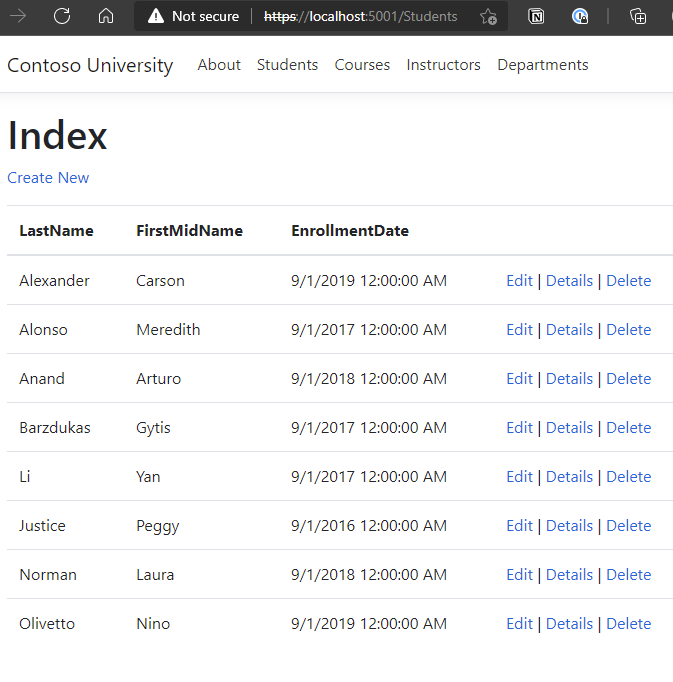

# Mild.EF.RazorPage.Example.ContosoUniversity

Following in Doc: [docs.microsoft.com - Razor Pages with Entity Framework Core in ASP.NET Core](https://docs.microsoft.com/en-us/aspnet/core/data/ef-rp/intro?view=aspnetcore-5.0&tabs=visual-studio-code)

All explanation are inside inline comment

# Features
- Razor Page
- SQLite

<!-- more -->



# Code Checkpoint in tutorial 

Following in Doc: [docs.microsoft.com - Razor Pages with Entity Framework Core in ASP.NET Core](https://docs.microsoft.com/en-us/aspnet/core/data/ef-rp/intro?view=aspnetcore-5.0&tabs=visual-studio-code)

1. [Tutorial 1 of 8 - Get Started](https://github.com/SukrepCode/DotNetCore.Templates/tree/b007ab26699f268b468e7a9cafd662cfcf626819/Mild.EF.RazorPage.Example.ContosoUniversity)

# Run

```sh
dotnet run
```

Open browser: https://localhost:5001/

```
dotnet ef database update
```

# Command

```
dotnet add package Microsoft.EntityFrameworkCore.SQLite -v 5.0.0-*
dotnet add package Microsoft.EntityFrameworkCore.SqlServer -v 5.0.0-*
dotnet add package Microsoft.EntityFrameworkCore.Design -v 5.0.0-*
dotnet add package Microsoft.EntityFrameworkCore.Tools -v 5.0.0-*
dotnet add package Microsoft.VisualStudio.Web.CodeGeneration.Design -v 5.0.0-*
dotnet add package Microsoft.AspNetCore.Diagnostics.EntityFrameworkCore -v 5.0.0-*

dotnet tool install --global dotnet-aspnet-codegenerator
dotnet aspnet-codegenerator razorpage -m Student -dc Mild.EF.RazorPage.Example.ContosoUniversity.Data.SchoolContext -udl -outDir Pages/Students --referenceScriptLibraries -sqlite
```

The scaffolding process:

- Creates Razor pages in the `Pages/Students` folder:
    - Create.cshtml and Create.cshtml.cs
    - Delete.cshtml and Delete.cshtml.cs
    - Details.cshtml and Details.cshtml.cs
    - Edit.cshtml and Edit.cshtml.cs
    - Index.cshtml and Index.cshtml.cs
    - Creates Data/SchoolContext.cs.
- Adds the context to dependency injection in `Startup.cs`.
- Adds a database connection string to `appsettings.json`. (Then we can change to be shorter version `"SchoolContext": "Data Source=CU.db"`)