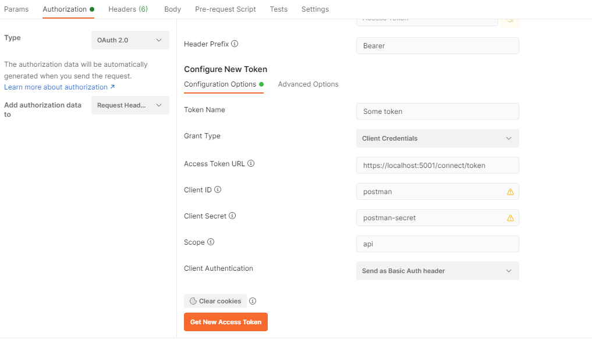
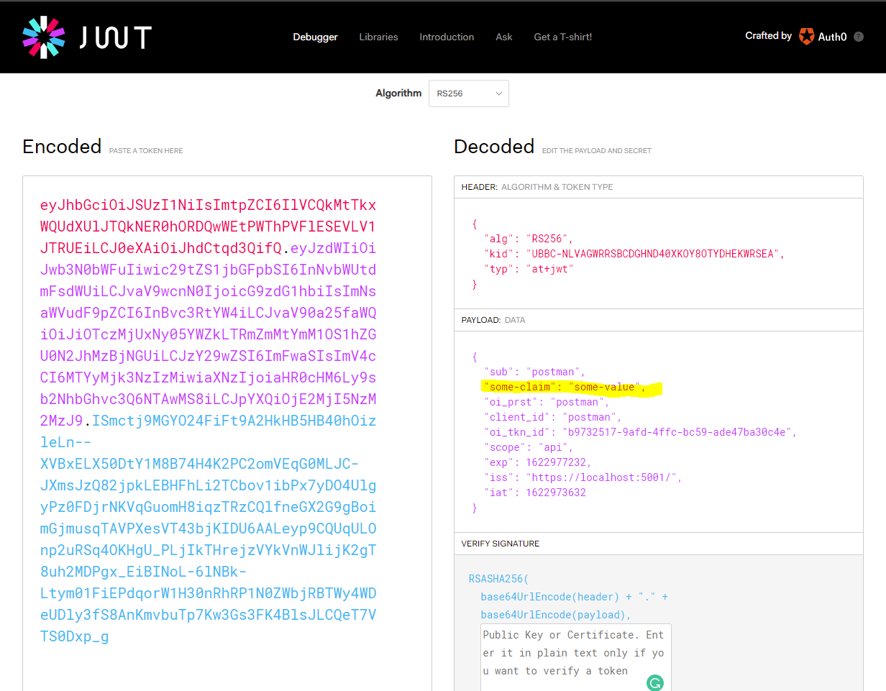

# Mild.MVC.Authentication.Openiddict.OAuth2.ClientCredentials

Enable the the [Client Credentials Flow](https://oauth.net/2/grant-types/client-credentials/), which is suitable for **machine-to-machine** applications.

# Features
- MVC
- Cookie Authentication (SSR) 
- Razor Page controlled by the Controller
- Session Management 
- Use `Openiddict` for OAuth2 


# Limitation
- No connect to any DB

# Run

```sh
dotnet run
```

Open browser: https://localhost:5001/

# Behind the scene

We can test the connection by Postman

`/TestData.cs` is a simple app that register Postman. We set these variables.

```c#
ClientId = "postman",
ClientSecret = "postman-secret",
```

To test purpose, you can uncomment `// .DisableAccessTokenEncryption();` in `Startup.cs` for disable encryption.

Then, test the connection with Postman:



When you click on `Get New Access Token` to can see the **Token**; (It's should work.)

You can copy this token to <https://jwt.io> for decoding JWT



You can see, the `"some-claim": "some-value",` in the token.


# Ref
https://dev.to/robinvanderknaap/setting-up-an-authorization-server-with-openiddict-part-iii-client-credentials-flow-55lp